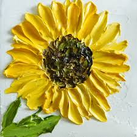
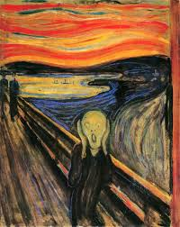

# Style Transfer

## Brief Description

This tutorial introduces students to **Neural Style Transfer (NST)**, a technique that blends the content of one image with the artistic style of another using a fixed, pre-trained **VGG19** network. Unlike traditional neural networks that update model weights, NST instead optimizes the pixels of the input image.
This unconventional setup makes NST an ideal entry point for understanding how convolutional networks represent structure and texture.

Students will explore how CNN feature maps encode visual information, how Gram matrices serve as texture fingerprints, and how adjusting content and style loss shapes the final output. The tutorial aims to build intuition for feature extraction, linear-algebraic representations, and gradient-based optimization, so as to connect mathematics, coding, and artistic creativity.

## Tutorial Lead

Weimo Zhu

## Demos

<table>
  <tr>
    <th>Content Image</th>
    <th>Style Image</th>
    <th>Output Image</th>
  </tr>

  <!-- Demo 1 -->
  <tr>
    <td></td>
    <td></td>
    <td></td>
  </tr>

  <!-- Demo 2 -->
  <tr>
    <td></td>
    <td></td>
    <td></td>
  </tr>

  <!-- Demo 3 -->
  <tr>
    <td></td>
    <td></td>
    <td></td>
  </tr>

  <!-- Demo 4 -->
  <tr>
    <td></td>
    <td></td>
    <td></td>
  </tr>

  <!-- Demo 5 -->
  <tr>
    <td></td>
    <td></td>
    <td></td>
  </tr>

  <!-- Demo 6 -->
  <tr>
    <td></td>
    <td></td>
    <td></td>
  </tr>

</table>

## Future Steps

- Expand the tutorial with clearer modules on how style loss is computed through Gram matrices, why multiple VGG19 layers capture different artistic abstractions, and how gradient descent on the input image shapes the final stylized output.
- Integrate this NST module into the larger Math + Code + Art pipeline by applying their custom style-transfer models to the music-generated paintings.

## References

- PyTorch Neural Style Transfer Tutorial
https://pytorch.org/tutorials/advanced/neural_style_tutorial.html
- Chikorde, “From Content & Art: Introduction to Neural Style Transfer using …”, LinkedIn Pulse
https://www.linkedin.com/pulse/from-content-art-introduction-neural-style-transfer-using-chikorde/
